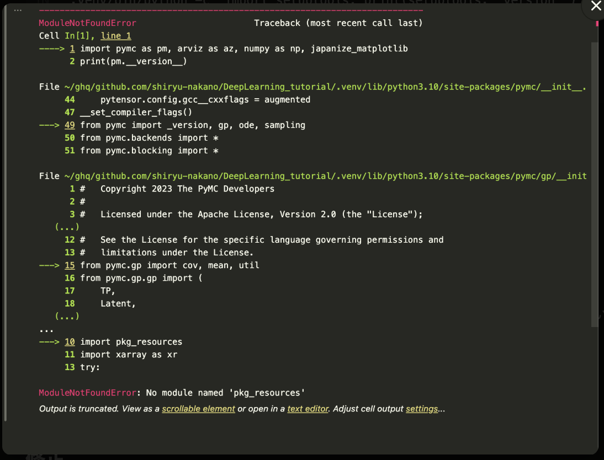

はい、uv ベースです。根拠は以下です。

pyproject.toml があり、[tool.poetry] や setup.py ではなく PEP 621 準拠の [project] テーブルで依存を定義している
ロックファイルが poetry.lock / Pipfile.lock ではなく uv.lock になっている（これは uv 固有）
.python-version に 3.10 が書かれており、uv が Python バージョン指定で参照する
典型的な使い方はこんな感じです。


# 依存インストール + venv 構築（uv.lock に従う）
```
uv sync
```
# main.py を venv の Python で実行
```
uv run python main.py
```
# 新しい依存を追加（pyproject.toml と uv.lock を自動更新）

```uv add scikit-learn```

# Jupyter を起動（notebook/ を使うなら）
uv run jupyter lab
uv sync するだけで .venv/ が uv.lock 通りに再現されるので、他マシンでの再現性はこれだけで足ります。


# ipynbをuvで動かすための手順

```
uv sync
```

```
uv add --dev jupyterlab ipykernel
```
ここで
- jupyterlabはノートブックUI本体
- ipykernelは作成した仮想環境.venvをJupyterのカーネルとして使えるようにするためのアダプタ→よくわからん


つぎに一応テスト用のipynbを作成するコマンドを．
```
mkdir -p notebook
uv run python -c "import nbformat as nbf, pathlib; nb=nbf.v4.new_notebook(); nb.cells=[nbf.v4.new_code_cell('import pymc as pm, arviz as az, numpy as np, japanize_matplotlib\nprint(pm.__version__)')]; pathlib.Path('notebook/intro.ipynb').write_text(nbf.writes(nb))"

```
その後vscodeでこれを開いて実行する．この時にカーネルとしてこのリポジトリで作成したカーネルを選択すること．

- [Visual Studio Codeにより起動したJupyter Notebookからuvで作成したカーネルを選択する手順 #Python - Qiita](https://qiita.com/daikikatsuragawa/items/bfa7314e3930856e6a83)

## 記録
実行したら，以下のエラーが出た


これは，

> 原因
> .venv の setuptools が 82.0.1（最新）
> setuptools 81 以降で pkg_resources モジュールが削除された
> しかし PyMC 5.7.2（2023年リリース）は古い API の pkg_resources を内部で使っている
> → import pymc が pkg_resources を探して失敗
> pyproject.toml:15 で setuptools をバージョン無指定にしているため、uv sync 時に最新版（= >
> pkg_resources 無し）が入ってしまったのが直接の引き金です。
ということなので，setuptoolsのバージョンを，最新にならないように指定した．
pytroject.tomlをで
setuptoops<81
と書いた．

---
